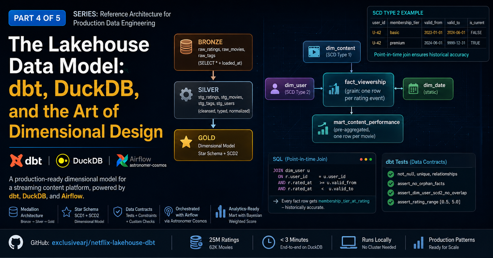

# netflix-lakehouse-dbt



> Medallion-architecture dbt project on DuckDB modeling the Netflix viewership domain. Star schema, SCD Type 2 user dimension, dbt data contracts, Bayesian-weighted content score, and Airflow + Cosmos orchestration.

## Stack

| Layer | Tech |
|---|---|
| Engine | DuckDB (single-node OLAP) |
| Transform | dbt-core + dbt-duckdb |
| Source | MovieLens 25M (25M ratings, 62K movies) + synthetic users.csv |
| Orchestration | Astronomer Airflow 3.1 (Astro Runtime 3.1-5) + astronomer-cosmos (DbtTaskGroup) |
| Data quality | [`pipeline-observe`](vendor/) — vendored wheel |

## Problem statement

Model the viewership and content domain for a Netflix-like streaming platform so that:

- Analysts can answer business questions about content performance without writing complex SQL
- ML engineers can derive user engagement features from the Gold layer directly
- Historical accuracy is preserved — queries can reconstruct state as of any past date
- The model is self-documenting via dbt and data contracts

## Architecture

```
seeds/ (movies, tags, users)  +  ratings.csv (streamed via read_csv, not seeded*)
        │
        ▼
Bronze: raw_ratings (read_csv), raw_movies, raw_tags, raw_users   (views, +_loaded_at)
        │
        ▼
Silver: stg_ratings, stg_movies, stg_tags, stg_users         (cleaned + typed)
        │
        ▼
Snapshot: dim_user_snapshot (SCD Type 2)
        │
        ▼
Gold:
  dim_content (SCD1)        ─┐
  dim_user (SCD2 view)       │
  dim_date                   ├─▶  fact_viewership (grain: user × movie × event)
                             │       │ point-in-time joined to dim_user
                             │       ▼
                             └─▶  mart_content_performance (Bayesian score)
```

> *The 25M-row `ratings` is **not** a dbt seed. `dbt seed` loads it via a single
> in-transaction `COPY` that DuckDB buffers entirely in memory (~11 GB) and gets
> OOM-killed in the Airflow container. `models/bronze/raw_ratings.sql` instead
> streams `seeds/ratings.csv` with `read_csv(...)` (memory-bounded, <2 GB);
> `dbt_project.yml` sets `ratings: +enabled: false`. movies/tags/users stay seeds.

## Source data profile

| Source Table | Rows | Key Columns | Quality Notes |
|---|---|---|---|
| ratings.csv | 25M | userId, movieId, rating, timestamp | No nulls; rating ∈ [0.5, 5.0] in 0.5 steps |
| movies.csv | 62K | movieId, title, genres | genres is pipe-delimited; year embedded in title |
| tags.csv | 1M | userId, movieId, tag, timestamp | Free-text; duplicates exist |

## One-command setup (host)

```bash
make all
```
Equivalent to:
1. `make setup` — download MovieLens 25M + generate users.csv
2. `make deps`  — `pip install -r requirements.txt && dbt deps`
3. `make build` — `dbt seed` → `dbt run --select +stg_users` → `dbt snapshot` → `dbt run` (snapshot interleaved between staging and gold — see Troubleshooting)
4. `make test`  — `dbt test`

Then `make docs` to open the docs site.

Every Python target (`make setup`, `make build`, `make test`, `make docs`, `make snapshot`) auto-creates a Python 3.11 virtualenv at `.venv/` on first use via a marker file at `.venv/.deps-installed`. dbt packages are tracked separately by the `dbt_packages/` directory and re-installed whenever it's missing (e.g. after `make clean`) or `packages.yml` changes — so `make clean` re-runs `dbt deps` without rebuilding the whole venv. Subsequent calls are cached. Run `rm -rf .venv` to force a full rebuild — useful if the venv was left in a stale state. Override the interpreter with `PYTHON=python3.x make ...` if 3.11 is unavailable.

> **Troubleshooting**
> - `found N package(s) … but only 0 package(s) installed in dbt_packages`: run `make deps` (or `make all`) — the build now re-installs dbt packages automatically whenever `dbt_packages/` is absent.
> - `make build`/`make all` ordering: `dim_user_snapshot` reads the `stg_users` (silver) view and gold `dim_user` reads the snapshot, so `build` runs `seed → run +stg_users → snapshot → run` (the snapshot is interleaved between staging and gold). Don't reorder it to a plain `seed → snapshot → run`.
> - `dbt seed` on `movies` uses `+fast: false` (see `dbt_project.yml`): DuckDB 1.5.x's fast `COPY` parser rejects RFC-4180 escaped quotes (e.g. `"11'09""01 …"`), so that one small seed loads via the agate reader; `ratings`/`tags` stay on the fast path.

## Airflow + Cosmos

```bash
make airflow-up
```

Builds the `p2-airflow` image, then brings up postgres + airflow-init + webserver + scheduler + triggerer + dag-processor. UI: <http://localhost:8080> (admin/admin).

> Use `make airflow-up`, not a bare `docker compose up -d`. Only `airflow-init`
> declares a build context; on a fresh checkout the other services would try to
> *pull* `p2-airflow:latest` (which exists only locally) and fail. The make
> target builds the image first so every service resolves it.

| DAG | Schedule | Purpose |
|---|---|---|
| `lakehouse_daily_pipeline` | `0 2 * * *` | seed → Bronze (Cosmos DbtTaskGroup) → Silver → snapshot → Gold → `pipeline-observe` quality checks on `mart_content_performance` |
| `movielens_data_refresh` | `0 1 1 * *` | monthly source refresh; triggers `lakehouse_daily_pipeline` on success |
| `dbt_docs_publish` | manual / on-success | `dbt docs generate` → copy to `/www/dbt_docs` → Slack notification |

The Cosmos `DbtTaskGroup` pattern creates **one Airflow task per dbt model** — granular retry without re-running the whole layer. Visible in Graph view.

### Airflow operational notes (DuckDB + Cosmos)

Wiring a single-file DuckDB into Cosmos + Airflow needs a few non-obvious settings (all in `airflow/include/dbt_project_config.py` and the DAG):

- **Parse from the manifest, not `dbt ls`.** Cosmos defaults to running `dbt ls` at DAG-parse time (once per `DbtTaskGroup`), which blows past the 30 s `dagbag_import_timeout`. We set `LoadMode.DBT_MANIFEST` + `ProjectConfig(manifest_path=target/manifest.json)`. **The manifest must exist before the scheduler parses** — generate it with `make all` / `dbt parse` on the host (it's bind-mounted into the container).
- **Reuse the project `profiles.yml`.** `ProfileConfig(profiles_yml_filepath=…/profiles.yml)`, not a generated profile — Cosmos's `DuckDBUserPasswordProfileMapping` produced a profile dbt-duckdb 1.10 rejects (`'database' must be 'memory' to match 'path'`).
- **Serialize the DAG: `max_active_tasks=1`.** DuckDB is single-writer; Cosmos runs each model as its own `dbt` process, so parallel tasks collide on the file lock.
- **Schema names are `main_<layer>`.** dbt-duckdb prefixes the custom schema with the `main` target, so the DuckDBHook/SQL use `main_gold`, `main_seeds` (not `gold`/`seeds`). The snapshot's `target_schema: gold` lands in a bare `gold` schema (asymmetry).
- **Memory & paths via env** (`docker-compose.yml`): `DUCKDB_MEMORY_LIMIT=2GB`, `RATINGS_CSV_PATH=/usr/local/airflow/dbt/seeds/ratings.csv`.

> **Heads-up — host vs Airflow share one DuckDB file**, and DuckDB allows a single
> writer. Don't run host `make build`/`make all` and the Airflow pipeline at the same
> time. Likewise, this project's Airflow stack and project 4's full stack together
> exceed a 5.8 GB Docker VM (Kafka/seed tasks OOM, exit 137) — **run one stack at a
> time, or raise Docker Desktop memory.** If an Airflow task OOMs, check `docker ps`
> for the other project's stack before debugging code.

## Design & modeling decisions

### Star schema vs. snowflake

**Decision: star schema (denormalized dims).**

- Query performance: DuckDB is a columnar OLAP engine — wide tables scan faster than multi-join snowflakes
- Analyst ergonomics: fewer joins for the most common queries
- Netflix's own data culture values fast, self-service analytics — star schema serves that
- Trade-off accepted: some redundancy in `dim_content` (genre repeated per movie)

Snowflake would be preferred if content metadata changed frequently (high SCD churn), or if storage cost at extreme scale was a concern. At 62K movies, denormalization wins.

### SCD strategy by dimension

| Dimension | SCD Type | Rationale |
|---|---|---|
| dim_content | Type 1 (overwrite) | Movie metadata rarely changes; release year / genres are immutable. Corrections should overwrite. |
| dim_user | Type 2 (history) | Membership tier changes are analytically significant — revenue attribution requires knowing what tier a user was on when they rated a title. |
| dim_date | Type 0 (static) | Calendar attributes never change by definition. |

**Why NOT SCD Type 2 for `dim_content`?** If a movie's genre classification is corrected (e.g., reclassified from Action to Action|Thriller), we want all historical fact rows to reflect the corrected classification — not preserve the "wrong" old state. This is a data quality correction, not a business event, so Type 1 (overwrite) is correct.

Exception: if we were tracking content licensing windows (`available_from` / `available_to` per region), that would warrant Type 2. Out of scope here but noted as a follow-up.

### Grain of fact_viewership

Grain: **one row per (user, content, rating event).**

This is finer than "one row per user+content" because a user can re-rate a movie. The `rating_sk` surrogate key ensures uniqueness. Analysts who want the "latest rating" should filter using a window function or use `mart_content_performance`, which pre-aggregates.

The fact table is point-in-time joined to `dim_user` (`rated_at BETWEEN dim_user.valid_from AND valid_to`) so each row exposes the historically-correct membership tier.

### Partitioning strategy

`fact_viewership` is partitioned by `rating_year` (derived from `rated_at`).

- Most analytical queries filter by time period
- DuckDB partition pruning eliminates full scans on large date ranges
- Monthly partitioning would be too granular for 25M rows; yearly is appropriate

### Surrogate keys

All dimension surrogate keys use `dbt_utils.generate_surrogate_key()` (MD5 hash of natural key fields). This ensures:

- Deterministic key values (idempotent `dbt run`)
- No dependency on database sequences
- Portability across DuckDB, BigQuery, Snowflake

### Bayesian-weighted content score

`mart_content_performance` ranks titles with a Bayesian-weighted score — `(C·m + n·avg) / (C + n)` — which prevents tiny-sample titles from dominating the leaderboard.

## Data contracts

Every model in the Gold layer has a `schema.yml` contract. Representative constraints:

```
dim_content:
  - content_sk: not_null, unique
  - movie_id: not_null, unique
  - release_year: not_null
  - era: not_null, accepted_values([classic, modern, contemporary, recent])
  - primary_genre: not_null

fact_viewership:
  - rating_sk: not_null, unique
  - user_sk: not_null, relationships(dim_user.user_sk)
  - content_sk: not_null, relationships(dim_content.content_sk)
  - date_sk: not_null, relationships(dim_date.date_sk)
  - rating_value: not_null   # range [0.5, 5.0] enforced by the assert_rating_range singular test
```

Referential integrity between facts and dims is enforced via `relationships` tests. The `assert_no_orphan_facts.sql` singular test is a belt-and-suspenders check.

## ML feature readiness

The Gold layer is designed so ML feature pipelines can pull directly from it:

| ML Use Case | Feature Source | Notes |
|---|---|---|
| Content-based filtering | dim_content.all_genres, release_year, era | No joins needed |
| Collaborative filtering | fact_viewership (userId, movieId, rating) | Grain is correct for matrix factorization |
| User engagement scoring | mart_content_performance | Pre-aggregated avg_rating, rating_count per content |
| Recency weighting | fact_viewership.days_since_release | Pre-computed at fact grain |

## What would change at Netflix scale

| This Project | At Netflix Scale |
|---|---|
| DuckDB (single node) | Apache Spark on EMR / Dataproc |
| dbt-duckdb | dbt-spark or dbt-bigquery |
| CSV seeds | Kafka → Bronze layer via Flink/Spark Streaming |
| Daily dbt run | Hourly incremental models with `is_incremental()` |
| SCD2 via dbt snapshot | Custom merge logic in Spark for sub-second SCD |
| Single partition column | Multi-column partitioning (year, month, content_type) |

## Repository layout

```
netflix-lakehouse-dbt/
├── dbt_project.yml, profiles.yml, packages.yml
├── setup.py                       ← MovieLens download + synthetic users
├── seeds/                         ← ratings.csv, movies.csv, tags.csv, users.csv
├── models/
│   ├── bronze/   (4 views)
│   ├── silver/   (4 views — cast, regex, dedup)
│   ├── gold/     (5 tables — dim_*, fact, mart)
│   └── schema.yml                 ← data contracts (not_null, unique, relationships, accepted_values)
├── snapshots/dim_user_snapshot.sql
├── tests/                         ← 3 custom singular tests
├── analyses/sample_queries.sql    ← 8 illustrative queries
├── docker-compose.yml             ← Airflow + Postgres + DuckDB volume
├── Makefile                       ← setup, build, test, docs, airflow-up, ...
├── airflow/                       ← Astronomer scaffold + 3 DAGs + Cosmos config + DuckDBHook
└── vendor/pipeline_observe-0.1.0-py3-none-any.whl
```

## Open questions / future work

1. **Tags integration**: `stg_tags` is modeled but not yet joined into the Gold layer. A `dim_tag` + `bridge_content_tag` would enable tag-based content discovery — good follow-up task.
2. **User demographics**: MovieLens 25M does not include demographic data. In a real Netflix model, `dim_user` would include age_group, country, device_preference — all candidates for SCD2.
3. **Content availability windows**: Licensing data (when a title becomes/stops being available) would require a `fact_content_availability` table with date-effective rows — a natural extension.

## Observe vendoring

`pipeline-observe` is committed under `vendor/` and `airflow/` so the repo is fully standalone. To develop the library and this project together, replace the wheel install with editable mode:

```bash
.venv/bin/pip install -e https://github.com/exclusivearj/pipeline-observe
```

